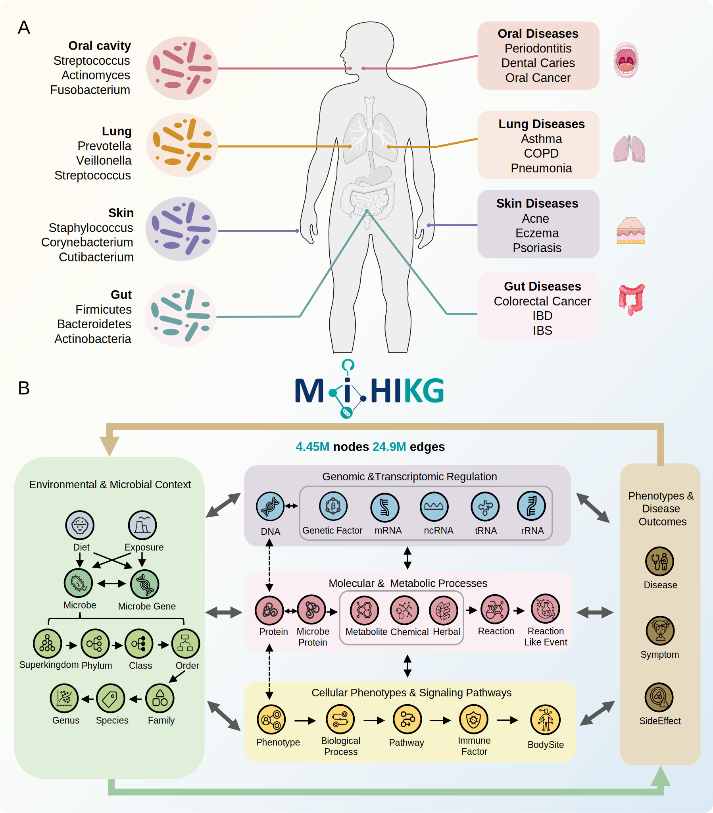
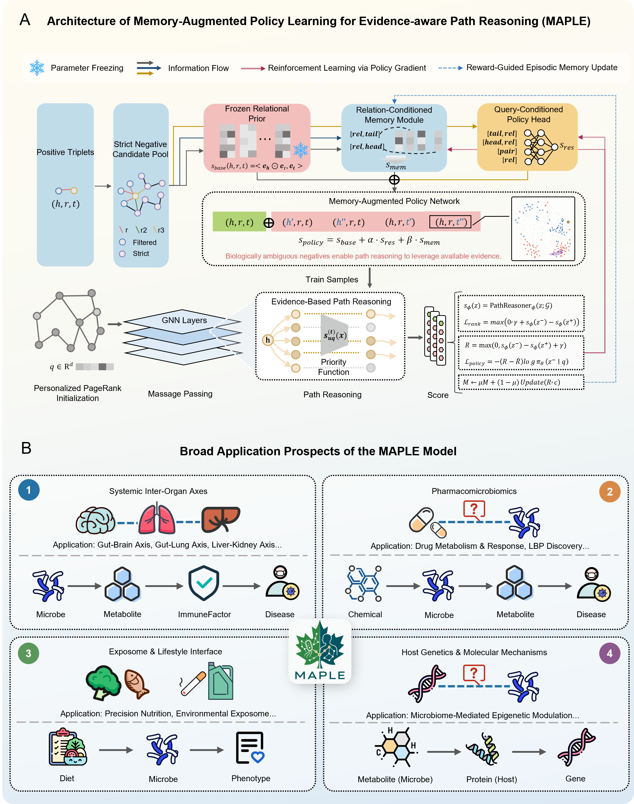

# Deciphering Microbe–Host Molecular Cascades via Knowledge-Guided Reinforcement Learning 

MAPLE (Memory-Augmented Policy Learning for Evidence-aware reasoning) is a knowledge-guided reinforcement learning framework for interpretable microbe-host mechanism discovery on MiHIKG / MicrobeKG.

This repository contains the runnable MAPLE model code, curated configuration files, visualization scripts, mapping files, and example figures used to demonstrate disease-to-microbe reasoning.

## Overview

The manuscript **“Deciphering Microbe–Host Molecular Cascades via Knowledge-Guided Reinforcement Learning”** introduces two connected components:

- **MiHIKG**: a large-scale, multi-source microbe-human interaction knowledge graph integrating microbes, metabolites, chemicals, host genes, immune factors, diseases, and other biomedical entities.
- **MAPLE**: an interpretable reasoning engine that combines A*Net-style path reasoning with a memory-augmented policy sampler for biologically plausible hard negatives.

MAPLE is designed to move beyond shallow co-occurrence prediction by ranking candidate microbe-host associations and exposing multi-hop evidence paths that connect diseases, microbes, metabolites, host targets, and regulatory mechanisms.


## Figures

### MiHIKG Knowledge Graph



Figure 1. Overview of the MiHIKG Knowledge Graph. (A) Anatomical distribution of the human microbiome and associated diseases. This panel illustrates representative bacterial communities colonizing key body sites (oral cavity, lungs, skin, and gut) and visualizes their associations with specific human pathologies, highlighting the systemic link between local microbial composition and host health. (B) The semantic architecture of MiHIKG. The schematic depicts the multi-scale ontology of the knowledge graph, displaying diverse biological entity categories including microbes, metabolites, host genes, and diseases, along with their interactions. This architecture explicitly models the heterogeneous information layers ranging from environmental factors to molecular mechanisms, thereby connecting the microbial and host systems.

### Topological and Functional Landscape


Figure 2 highlights the metabolite / chemical-centered topology of MiHIKG, showing how small molecules act as a bridge between microbial and host subnetworks.

### MAPLE Framework



Figure 3. Structural logic and translational application scenarios of the MAPLE framework. (A) Memory-augmented reinforcement learning framework for negative sampling and evidence-driven path reasoning in MAPLE. For a given positive triple, MAPLE first constructs a strict set of negative candidates. These candidates are ranked through a prior–policy–memory scoring process composed of the Frozen Relational Prior, Query-Conditioned Policy Head, and Relation-Conditioned Memory Module, thereby prioritizing biologically ambiguous hard negatives for path-evidence evaluation. A*Net then serves as an evidence-aware path reasoner. It initializes a source-conditioned evidence field, expands compact query-relevant subgraphs through priority-guided traversal, and propagates evidence along typed biomedical relations to evaluate whether each candidate is supported by coherent multi-hop paths. Reward signals generated from ranking-margin violations are further used to update the sampling policy through policy gradients and are written into episodic memory in a reward-guided manner, forming an optimization process of hard sample selection, pathevidence evaluation, and policy-memory updating. (B) Translational application scenarios of MAPLE. MAPLE can generate interpretable hypotheses from multilayered entities, including microbes, metabolites, immune factors, chemicals, phenotypes, and host molecular mechanisms. It supports systemic inter-organ axis analysis, pharmacomicrobiomics, exposome and lifestyle interface research, and the exploration of host genetics and molecular mechanisms.

## Repository Layout

```text
MAPLE_main02/
├── base_model.py                 # Shared embedding-model utilities
├── memory_distmult.py            # MAPLE memory-augmented DistMult generator
├── pretrain.py                   # DistMult generator pretraining entry
├── config.py                     # Legacy config loader used by training code
├── configs/
│   ├── train.yaml       # Full adversarial MAPLE training config
│   ├── reasoning.yaml            # Reasoning / visualization config template
│   └── quickstart_visualization.yaml
├── checkpoints/
│   └── maple_checkpoint.pth      # Local MAPLE checkpoint used by quickstart
├── data/
│   ├── mappings/                 # Small entity / relation mapping tables
│   └── external/                 # Optional place for full MicrobeKG data
├── imgs/                         # README figures
├── reasoning/                    # A*Net / TorchDrug-based KGC engine
├── script/
│   ├── train.py                  # MAPLE training / evaluation entry
│   ├── visualize_disease_microbes.py
│   └── visualize_cad_metabolite.py
└── run.sh                        # Quickstart script
```

## Method Summary

MAPLE trains a path reasoner and a hard-negative sampler together:

1. **Strict candidate generation** builds negative candidates under type and graph constraints.
2. **Frozen relational prior** provides global DistMult-style plausibility scores.
3. **Query-conditioned policy head** adapts negative sampling to the current query context.
4. **Relation-conditioned memory module** stores reward-guided feedback for confusing relation-specific candidates.
5. **A*Net evidence reasoning** expands compact query-relevant subgraphs and scores candidates through multi-hop biomedical paths.
6. **Reward feedback** updates the sampler when hard negatives violate ranking margins, encouraging biologically meaningful discrimination.

## Environment

The code expects a Python environment with PyTorch and graph-learning dependencies available. Typical packages include:

- `torch`
- `numpy`
- `pyyaml`
- `easydict`
- `jinja2`
- `tqdm`
- `torch-scatter`
- `torch-sparse`
- `scikit-learn`
- `matplotlib`

The repository vendors a local `reasoning/TorchDrug/` implementation, so run commands from the repository root.

## Data and Checkpoints

The quickstart checkpoint is:

```text
checkpoints/maple_checkpoint.pth
```

## Quickstart

Run the disease-to-microbe visualization example:

```bash
bash run.sh
```

`run.sh` intentionally keeps the training command commented out and only executes:

```bash
python script/visualize_disease_microbes.py -c configs/quickstart_visualization.yaml
```

The script loads the MAPLE checkpoint, ranks candidate microbes for predefined disease heads, filters known training triples, and prints top novel predictions with interpretable path evidence.

