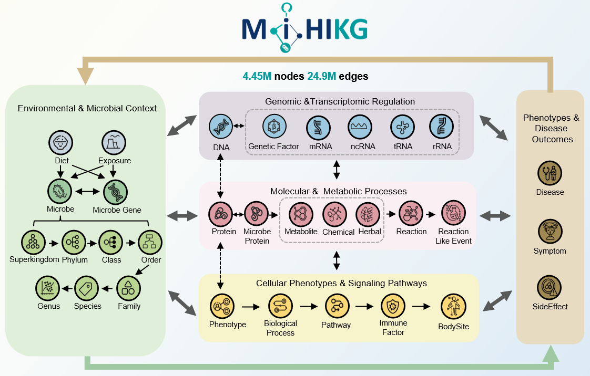
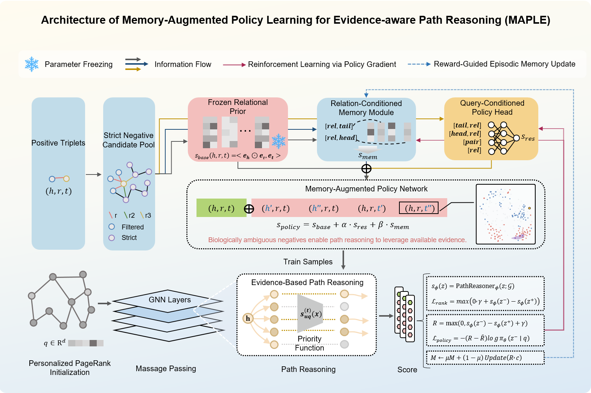

Deciphering microbe–host molecular cascades via memory-augmented reinforcement learning on knowledge graphs
======================================================

**MAPLE** is a memory-augmented, policy-guided reasoning framework for decoding interpretable **microbe–host molecular cascades** from the multi-scale knowledge graph **MiHIKG**. It couples high-fidelity biomedical knowledge infrastructure with an evidence-aware path reasoner, enabling systematic discovery of microbiome-mediated disease mechanisms.

🌐 MiHIKG: Microbe–Human Interaction Knowledge Graph
----------------------

To support mechanistic microbiome research beyond isolated association mining, we built **MiHIKG (Microbe–Human Interaction Knowledge Graph)** as a unified semantic infrastructure.

* **Large-scale integration**: MiHIKG integrates **57 biomedical databases**, covering **4.45M+ nodes** and **24.98M+ edges** across microbes, metabolites, chemicals, host genes, diseases, immune factors, pathways, phenotypes, and environmental exposures.
* **High-fidelity standardization**:
  * Microbial nodes are mapped to standardized TaxIDs to improve cross-database interoperability.
  * Disease, phenotype, taxonomic, metabolite, and host molecular entities are harmonized into a computable graph schema.
  * Directional relation names preserve biomedical semantics such as microbe-induced disease, metabolite-mediated signaling, and host regulatory events.
* **Metabolite-centered topology**:
  * MiHIKG reveals that metabolites and chemicals act as the major semantic bridge between microbial perturbations and host responses.
  * This design supports long-range reasoning across microbial taxa, metabolic products, host genes, immune factors, and disease phenotypes.



🧠 MAPLE: Memory-Augmented Policy Learning Engine
---------------

**MAPLE** is designed for interpretable biomedical knowledge graph completion under sparse, noisy, and biologically heterogeneous evidence. It addresses two common problems in microbe-host KG reasoning: trivial negative samples and weak mechanistic interpretability.

The model code builds upon [A*Net](https://github.com/DeepGraphLearning/AStarNet) for neural path-based reasoning and [TorchDrug](https://github.com/DeepGraphLearning/torchdrug) for graph learning infrastructure.

* **Evidence-aware path reasoning**: MAPLE uses an A*Net-style path reasoner to expand compact query-relevant subgraphs and evaluate candidate triples through coherent multi-hop biomedical paths.
* **Policy-guided hard negative mining**:
  * A **Frozen Relational Prior** provides global DistMult-style plausibility.
  * A **Query-Conditioned Policy Head** adapts candidate selection to the current disease / microbe / metabolite query.
  * A **Relation-Conditioned Memory Module** stores reward feedback for confusing relation-specific negatives.
* **Reward-driven learning loop**: Ranking-margin violations generate reward signals that update the sampler, helping MAPLE focus on biologically plausible confounders rather than random false negatives.
* **Interpretable output**: The visualization scripts rank candidate disease-microbe or disease-metabolite associations and print reasoning paths as testable mechanistic hypotheses.



📈 Application Scenarios
----------

MAPLE is built as a “digital scientist” for mechanism-oriented microbiome discovery.

* **Disease-associated microbe discovery**: prioritize candidate microbes for predefined disease entities while filtering known training triples.
* **Metabolic cascade interpretation**: connect microbial taxa to disease phenotypes through metabolites, chemicals, host genes, immune factors, and pathways.
* **Cardiovascular mechanism mining**: support CAD / AMI case studies by ranking metabolite-linked mechanisms such as PAG or butyrate-related networks.
* **Sparse-evidence reasoning**: infer functionally convergent paths when direct microbe-disease evidence is incomplete.
* **Translational hypothesis generation**: produce ranked candidates and multi-hop path evidence for downstream wet-lab or cohort validation.

📁 Repository Layout
-------

```text
MAPLE_main02/
├── README.md                         # Project overview and usage guide
├── run.sh                            # Quickstart: visualization only by default
├── config.py                         # Legacy config helper used by generator modules
├── pretrain.py                       # DistMult generator pretraining entry
├── memory_distmult.py                # MAPLE memory-augmented DistMult generator
├── base_model.py / distmult.py       # Generator model components
├── configs/
│   ├── train.yaml                    # MAPLE adversarial training configuration
│   └── quickstart_visualization.yaml # Disease-microbe visualization configuration
├── data/
│   ├── train.txt / valid.txt / test.txt
│   └── mappings/
│       ├── entity.txt
│       └── relation.txt
├── checkpoints/
│   └── maple_checkpoint.pth          # MAPLE checkpoint for visualization / evaluation
├── imgs/
│   ├── figure1_mihikg_overview.png
│   └── figure2_maple.png
├── reasoning/                        # A*Net / TorchDrug-based KGC engine
└── script/
    ├── train.py                      # Training / evaluation entry
    ├── visualize_disease_microbes.py # Disease-to-microbe ranking and path evidence
    └── visualize_cad_metabolite.py   # CAD / AMI metabolite case visualization
```

⚙️ Environment Setup
-------

Create or activate a Python environment with PyTorch and graph-learning dependencies. Typical packages include:

```bash
pip install torch numpy pyyaml easydict jinja2 tqdm scikit-learn matplotlib
```

The project also requires CUDA-compatible graph extensions such as `torch-scatter` and `torch-sparse`. Install versions that match your local PyTorch / CUDA build.

🧩 Data and Checkpoints
-------

The current configs expect all dataset files to live inside this repository:

```text
data/
├── train.txt
├── valid.txt
├── test.txt
└── mappings/
    ├── entity.txt
    └── relation.txt
```

The default checkpoint path is:

```text
checkpoints/maple_checkpoint.pth
```

All paths in `configs/*.yaml` are repository-relative and are resolved to absolute paths at runtime, so training and visualization continue to work after the scripts create timestamped output directories.

🚀 Quick Start
-------

### 1. Run Disease-to-Microbe Visualization

```bash
bash run.sh
```

`run.sh` intentionally keeps training commented out and only runs the quickstart visualization:

```bash
python script/visualize_disease_microbes.py -c configs/quickstart_visualization.yaml
```

The script loads the MAPLE checkpoint, ranks candidate microbes for predefined disease heads, filters known training triples, and prints top novel associations with path evidence.

### 2. Run MAPLE Training

Full adversarial training is computationally expensive. Review GPU, batch size, output directory, and epoch settings before running:

```bash
python script/train.py -c configs/train.yaml
```

### 3. Run CAD / AMI Metabolite Visualization

```bash
python script/visualize_cad_metabolite.py -c configs/quickstart_visualization.yaml
```

🔧 Configuration Notes
-------

* `configs/train.yaml`: full MAPLE adversarial training configuration.
* `configs/quickstart_visualization.yaml`: checkpoint-based visualization configuration.
* `dataset.path`: defaults to `data/`.
* `checkpoint`: defaults to `checkpoints/maple_checkpoint.pth`.
* `engine.gpus`: controls the CUDA device; visualization scripts no longer hard-code GPU IDs.
* `output_dir`: defaults to `outputs/...` and is ignored by Git.

📄 Citation
-----

If you use MAPLE or MiHIKG in your research, please cite:

```bibtex
@article{li2026maple,
  title={Deciphering microbe–host molecular cascades via memory-augmented reinforcement learning on knowledge graphs},
  author={Li, Shiliang and Dou, Pan and Yang, Xiaobo and Li, Wenweiran and Zhang, Yiqing and others},
  year={2026}
}
```

---
