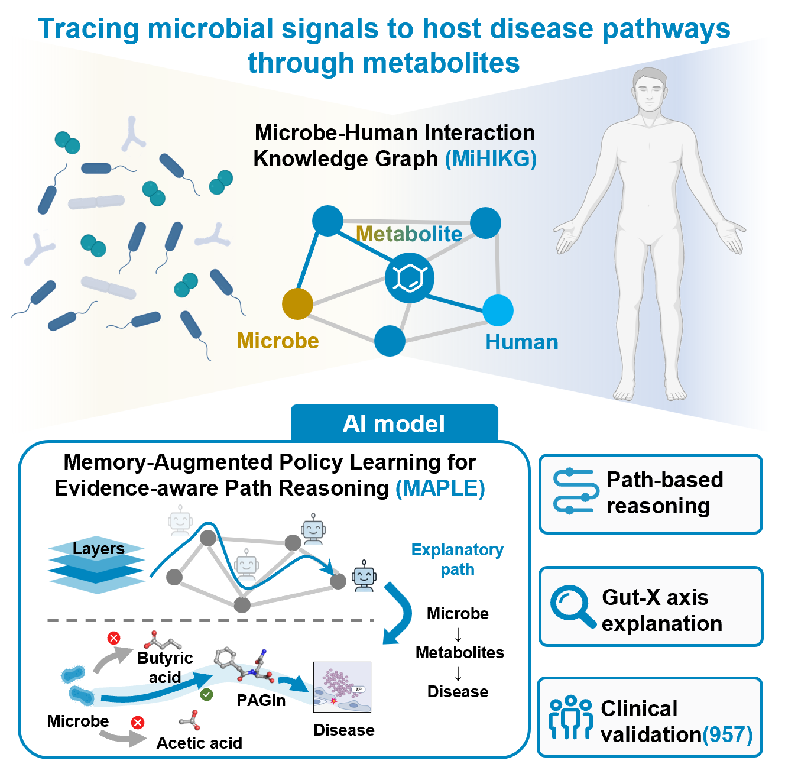
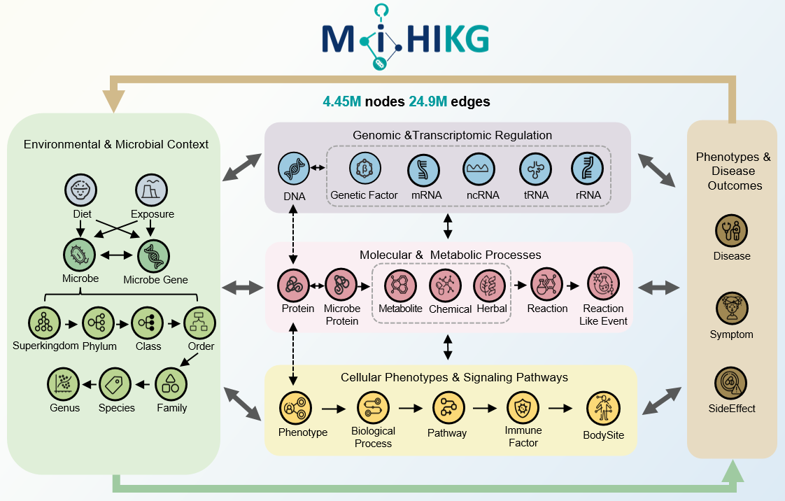
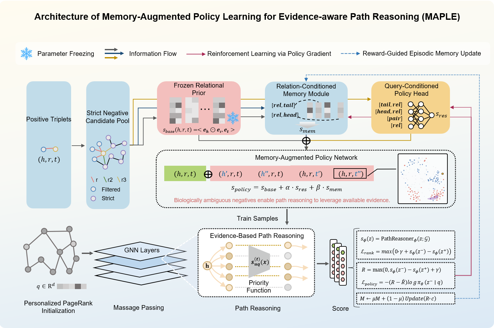

<div align="center">

**🎉 MAPLE Web Service**

MAPLE has been further developed into a web service for human health and microbiome interaction research, providing researchers with public access to MiHIKG.

[https://www.lilab-ecust.cn/MAPLE](https://www.lilab-ecust.cn/MAPLE)

</div>

<p align="center">
  
</p>

<p align="center">
  <a href="#quickstart">Quickstart</a> &middot;
  <a href="#data-and-availability">Data</a> &middot;
  <a href="#repository-map">Repository Map</a> &middot;
  <a href="#citation">Citation</a>
</p>

MAPLE is a memory-augmented policy-learning framework for interpretable reasoning over the Microbe-Human Interaction Knowledge Graph (MiHIKG). It ranks candidate microbe-disease links and returns multi-hop evidence paths from microbial signals through molecular processes to disease phenotypes.

## MiHIKG: Microbe-Human Interaction Knowledge Graph

MiHIKG provides a unified semantic infrastructure for mechanism-oriented microbiome research beyond isolated association mining. It integrates 57 biomedical databases into a graph of 4.45M+ nodes and 24.98M+ edges spanning microbes, metabolites, chemicals, host genes, diseases, pathways, phenotypes, and environmental exposures.

- **Standardized biomedical entities:** microbial nodes are mapped to TaxIDs, while disease, phenotype, taxonomic, metabolite, and host molecular entities are harmonized into a computable schema.
- **Directional biological semantics:** relation names preserve mechanistic directionality, including microbe-induced disease, metabolite-mediated signaling, and host regulation.
- **Metabolite-centered topology:** metabolites and chemicals bridge microbial perturbations with host responses, enabling reasoning across taxa, molecular processes, immune factors, and disease phenotypes.

<p align="center">
  
</p>

## MAPLE: Memory-Augmented Policy Learning

Built on [A*Net](https://github.com/DeepGraphLearning/AStarNet) and [TorchDrug](https://github.com/DeepGraphLearning/torchdrug), MAPLE is designed for biomedical knowledge graph completion under sparse, noisy, and heterogeneous evidence. It combines a query-focused path reasoner with a memory-augmented policy for selecting informative hard negatives.

- **Evidence-aware path reasoning:** an A*Net-style reasoner expands compact, query-relevant subgraphs and scores candidate triples through coherent multi-hop paths.
- **Frozen relational prior:** pretrained DistMult embeddings provide global plausibility while the policy and memory modules adapt candidate selection to each query.
- **Reward-driven policy learning:** ranking-margin violations update relation-conditioned memory and focus sampling on biologically plausible confounders rather than random negatives.
- **Interpretable output:** visualization scripts return ranked microbe-disease links together with path evidence for downstream biological interpretation.

<p align="center">
  
</p>

## Quickstart

Run the two-stage pipeline from the project root:

```bash
python script/quickstart_pipeline.py \
  --config configs/quickstart_train.yaml \
  --gpu 0
```

The pipeline uses the packaged graph in `data/quickstart/` and writes run artifacts to `outputs/quickstart_pipeline/`.

1. Train DistMult when `pretrain_gen_model` is absent.
2. Freeze the pretrained DistMult backbone.
3. Train MAPLE with reinforcement-guided hard-negative sampling.
4. Select the best MAPLE checkpoint by validation MRR and evaluate it on the test split.

Use `--force-pretrain` to replace an existing Quickstart DistMult checkpoint.

> [!NOTE]
> The packaged execution demo contains 1,000 nodes, 2,000 connected triples, and five microbe-host cascade relations. Its `1,940 / 30 / 30` train/validation/test split is relation-balanced, with held-out triples chosen using graph topology only. It is provided to validate installation and the complete training workflow; it is not a substitute for full-scale benchmark evaluation.

### Full-Scale Training

Full MiHIKG experiments use the same entry point with the full configuration and privately available data:

```bash
python script/quickstart_pipeline.py \
  --config configs/train.yaml \
  --gpu 0
```

## Data and Availability

The repository includes the self-contained Quickstart graph required for execution-demo training. Full MiHIKG files and large checkpoints are excluded from version control and will be released during peer review. After publication, the model and dataset are planned as an accessible web resource, which is currently under development.

Place private full-scale data under `data/` and checkpoints under `checkpoints/` when reproducing large-scale experiments. Large source caches and `.pth` checkpoints remain excluded by `.gitignore`.

## Repository Map

| Path | Purpose |
| --- | --- |
| `configs/quickstart_train.yaml` | Packaged two-stage training configuration. |
| `configs/train.yaml` | Full-scale training configuration. |
| `data/quickstart/` | Packaged connected execution-demo graph. |
| `pretrain.py` | DistMult pretraining entry point. |
| `script/quickstart_pipeline.py` | Shared DistMult-to-MAPLE training entry point. |
| `script/train.py` | MAPLE training and evaluation entry point. |
| `script/visualize_*.py` | Link-ranking and explanatory-path visualization scripts. |
| `reasoning/` | A*Net and TorchDrug-based reasoning engine. |

## Citation

```bibtex
@article{li2026maple,
  title={Deciphering microbe–host molecular cascades via memory-augmented reinforcement learning on knowledge graphs},
  author={Li, Shiliang and Dou, Pan and Yang, Xiaobo and Li, Wenweiran and Zhang, Yiqing and others},
  year={2026}
}
```
